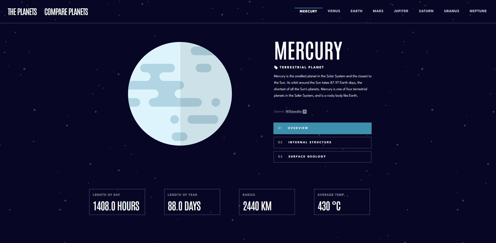

# Final project - IT Factory - Python Course
### Project name: Planets-fact-site
####

- [Link to access the deployed version of the project](http://simaelisabetaprojectplanets.pythonanywhere.com/)

## Table of contents

- [Overview](#overview)
    -   [Intro](#intro)
- [My process](#my-process)
    -   [Built with](#built-with)
    -   [Features](#features)
- [Setup](#setup)


## Overview

### Intro

Hello! This is my project showcase for the final exam of the Python course I completed at [ITFactory](https://www.itfactory.ro/). \
I am proud to present my first web page project built with the Django framework. Throughout the development process, 
I utilized my knowledge of Python programming and incorporated as many of the learned concepts as possible. <br><br>
My primary objective was to create a functional application from a backend perspective. However, 
I also made an effort to grasp the fundamental principles of frontend development and implemented them in my project 
with the assistance of [Frontend Mentor's](https://www.frontendmentor.io/challenges/planets-fact-site-gazqN8w_f) challenge and design resources.


## My process

### Built with

- Python
- Django
- JsonResponse for REST API
- HTML5 markup
- CSS
- Bootstrap 5

### Features

- I used **_Django_** package to develop my application. Django is a high-level Python web framework that follows 
the Model-View-Template (MVT) architectural pattern. It provides a set of tools and libraries that simplify 
the development of web applications. Working with Django for this project was a pleasant experience as the MTV 
structure helped me organize my project effectively and understand each step clearly.
- For implementing my REST API, I used Django's **_JsonResponse_** class. This class facilitated the creation of 
HTTP responses containing JSON-formatted payloads. By utilizing this class, Python data structures like dictionaries 
and lists were automatically serialized into JSON format. To test the functionality of my REST API, you can navigate to
either the `api/` or `api/v1/planets/` URL. Please note that the `api/` help-page is currently under construction.
In the future it will provide instructions on how to utilize the API effectively.


## Setup

####
- Step 1 - 
Install [Google Chrome](https://www.googleadservices.com/pagead/aclk?sa=L&ai=DChcSEwiZpqDwjsX-AhWngFAGHSVwBVQYABAAGgJkZw&ohost=www.google.com&cid=CAESauD20c82cYwEF5faNLs1iPVZ02CcZob1yckwyCQ1CLZiKtYYSy5O5Q0bwcP85HMSC3BuOTmK3XPGAnHcvH2ykzFJGACu-FFvZjhrzJnZypgUCCzD_eAy_VdwfaIrHUck9YQOfegpYD2c8Yg&sig=AOD64_3hl9ERHq5kI30h4gtxs2cKNUFE6w&q&adurl&ved=2ahUKEwjRjZfwjsX-AhWOg_0HHWw-BPcQ0Qx6BAgHEAE)
####

- Step 2 - 
Install python 3
####

- Step 3 - 
Install PyCharm\
I used: PyCharm 2021.3.2 [Community Edition](https://www.jetbrains.com/pycharm/download/#section=windows)
####

- Step 4 - 
Install [Git](https://git-scm.com/downloads)
####

- Step 5 - Create a new folder and GitBash into it\
  Right-click in a local folder where you want to clone the project and click on **Git Bash Here**:  \
  Then in your terminal run the following command:\
  `$ git clone https://github.com/SimaElisabeta/Planets-fact-site.git`
####

- Step 6 - Once you've cloned the repository, open Pycharm\
  Click File -> Open... , navigate to the folder where you cloned the project, press `OK` and click `Trust Project`.
####

- Step 7 - Create a virtual environment\
In PyCharm navigate to File->Settings...->Project->Python Interpreter\
Click on Add Interpreter-> Add Local Interpreter and click `OK`.
####

- Step 8 - Navigate into the project in PyCharm terminal\
Go to Terminal (bottom side), click on the down arrow and click on `Command Prompt`\
Change the directory to plantes_fact_site app\
`$ cd plantes_fact_site`
####

- Step 9 - Install the following project's packages\
Instal Django package - `$ pip install django`\
Instal Pillow package - `$ pip install Pillow`
####

- Step 11 - Run the project\
If there are no hitches here you should now be able to open the server by running:\
```
$ cd plantes_fact_site
$ python manage.py runserver
```
####

- Step 12 - Open the localhost link (http://127.0.0.1:8000/) and enjoy!
####
